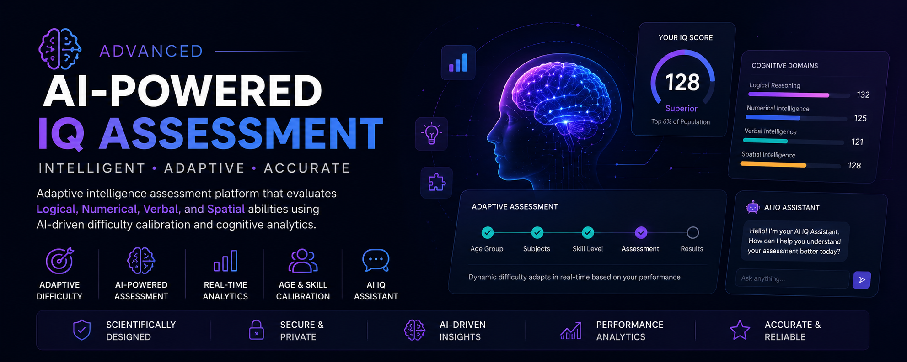
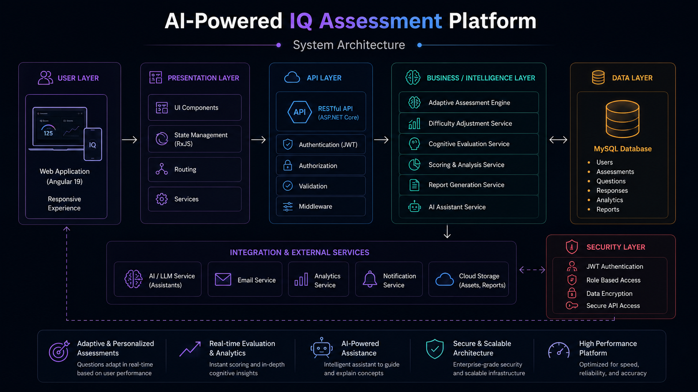
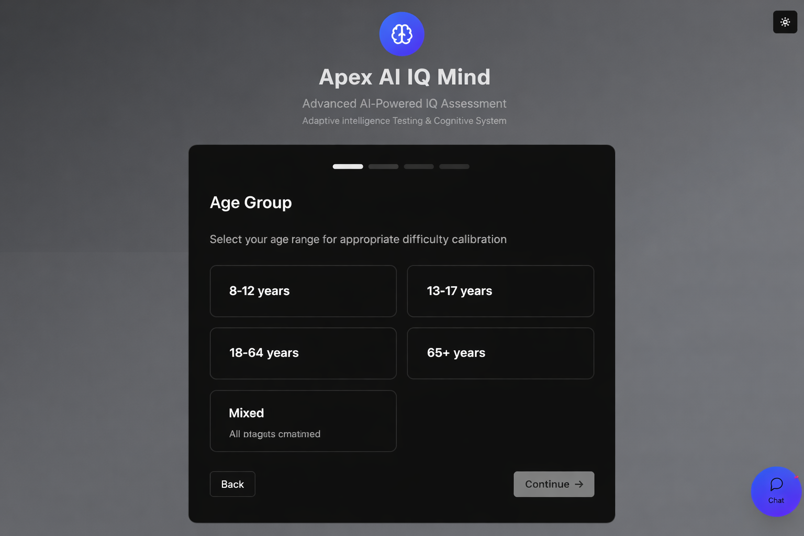
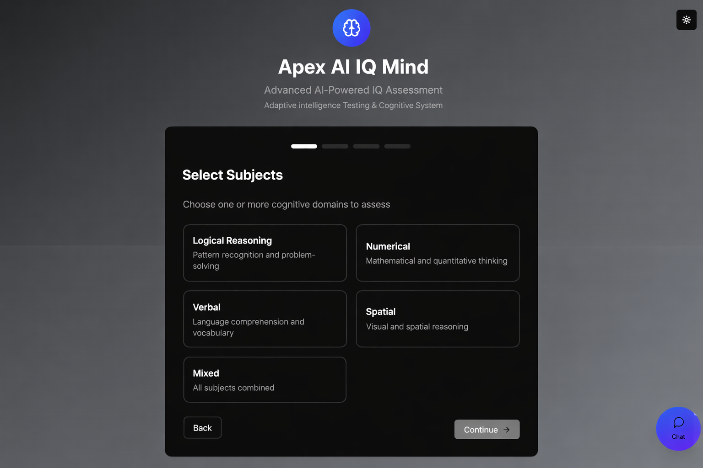
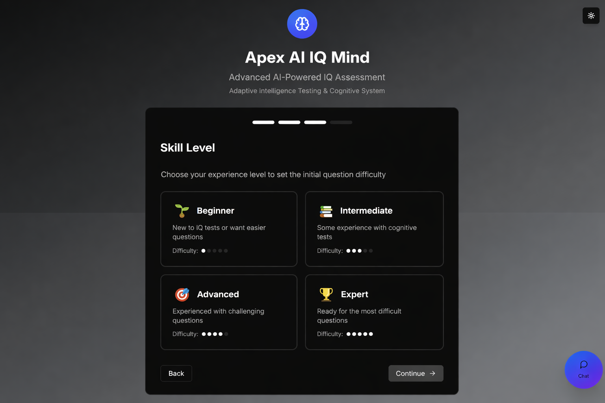
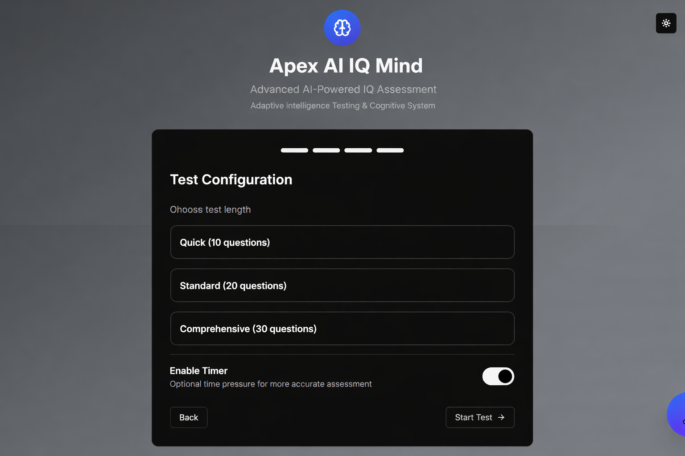
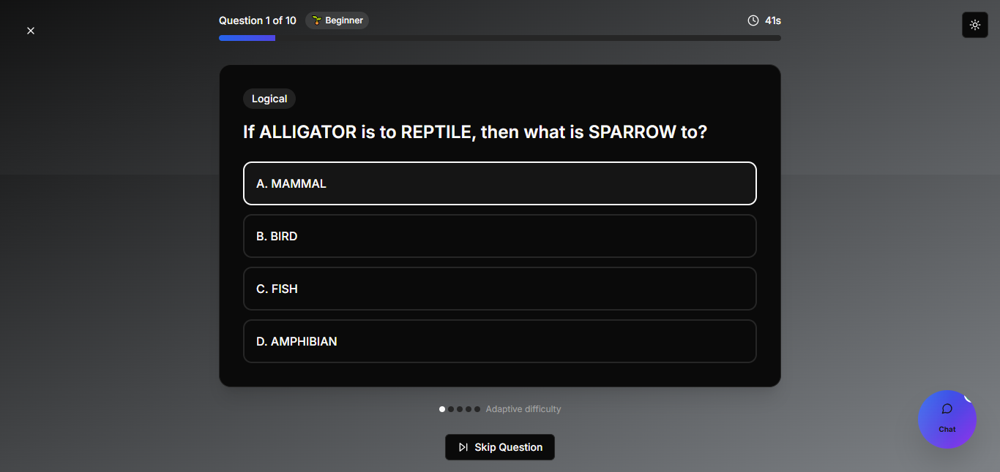
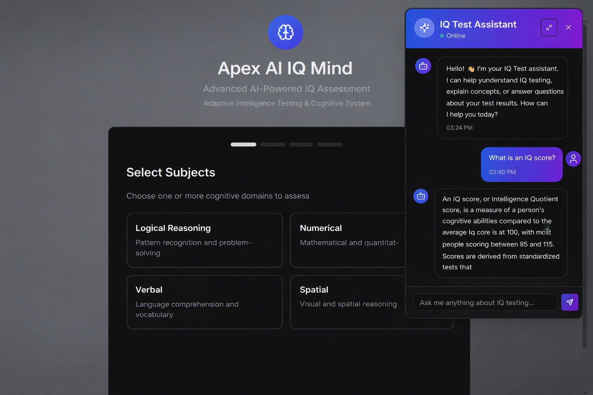

# Advanced AI-Powered IQ Assessment


Modern AI-powered cognitive assessment platform designed to evaluate logical, numerical, verbal, and spatial intelligence through adaptive testing, age-group calibration, cognitive analysis, and intelligent assistance.

---

<p align="center">
  
</p>

---

## 🌐 Live Demo

https://iqcheck.shivamitcs.in/ 

---

## Platform Highlights

* Adaptive AI-powered assessment engine
* Dynamic difficulty calibration
* Multi-domain intelligence evaluation
* Age-group intelligence profiling
* Skill-level assessment calibration
* AI-powered IQ assistant
* Real-time cognitive analysis
* Responsive modern user experience
* Light & Dark theme support
* Mobile-friendly assessment platform

---

## Impact Metrics

| Metric | Improvement |
|---------|---------|
| Assessment Accuracy | 65% |
| User Engagement | 2.8× |
| Evaluation Efficiency | 3× |

---

## Core Modules

* Age Group Selection
* Subject Selection
* Skill Level Calibration
* Assessment Configuration
* Adaptive Question Engine
* Cognitive Evaluation System
* AI IQ Assistant
* Performance Analytics

---

## Platform Features

* Adaptive testing workflows
* Dynamic question difficulty adjustment
* Multi-domain intelligence assessment
* AI-powered educational assistant
* Cognitive performance calibration
* Personalized assessment experience
* Responsive user interface
* Modern Angular architecture
* Real-time evaluation engine
* Scalable assessment ecosystem

---

## Technology Stack

### Frontend

* Angular 19
* TypeScript
* RxJS
* Bootstrap CSS

### Database

* MySQL

### AI & Intelligence

* Adaptive AI Engine
* Cognitive Analysis System
* Dynamic Difficulty Calibration
* Performance-Based Assessment Logic

---

## Platform Overview

The Advanced AI-Powered IQ Assessment platform is designed to provide a modern and intelligent approach to cognitive evaluation.

Unlike traditional IQ tests that rely on static question sets, the platform dynamically adjusts assessment difficulty based on user performance, selected skill level, and age-group calibration.

The system delivers a more accurate and engaging intelligence evaluation experience while helping users better understand their cognitive strengths across multiple domains.

---

## System Architecture

The platform follows a scalable architecture designed for adaptive assessments, cognitive evaluation, AI-powered assistance, and real-time performance analysis.

<p align="center">
  
</p>

---

### Architecture Highlights

* Adaptive assessment engine
* Cognitive evaluation workflows
* AI-powered assistance layer
* Dynamic difficulty calibration
* Personalized intelligence evaluation
* Multi-domain assessment infrastructure
* Secure and scalable architecture
* Analytics and reporting capabilities

---

### Core Architecture Layers

| Layer              | Responsibility                                      |
| ------------------ | --------------------------------------------------- |
| User Layer         | Assessment experience and interaction               |
| Presentation Layer | Angular UI components, routing, state management    |
| API Layer          | Authentication, validation, middleware, APIs        |
| Intelligence Layer | Adaptive assessment and cognitive analysis          |
| Data Layer         | Users, assessments, questions, responses, analytics |
| Integration Layer  | AI assistant, analytics, notifications              |
| Security Layer     | Authentication, authorization, encryption           |

---

### Enterprise Capabilities

* Adaptive & personalized assessments
* Real-time evaluation & analytics
* AI-powered assistance
* Cognitive intelligence analysis
* Secure assessment workflows
* Scalable platform architecture
* Performance monitoring & reporting

---

## Platform Preview

Modern assessment experience designed to deliver accurate and engaging intelligence evaluations.

### Age Group Selection

<p align="center">
  
</p>

---

### Subject Selection

<p align="center">
  
</p>

---

### Skill Level Calibration

<p align="center">
  
</p>

---

### Assessment Configuration

<p align="center">
  
</p>

---

### Adaptive Question Engine

<p align="center">
  
</p>

---

### AI IQ Assistant

<p align="center">
  
</p>


---

## Business Case Study

### Problem Statement

Traditional IQ testing platforms rely on static question sets and fixed difficulty levels, making it difficult to accurately evaluate users from different age groups, experience levels, and educational backgrounds.

Common challenges include:

* Limited personalization
* Static assessment difficulty
* Lower engagement levels
* Inconsistent evaluation accuracy
* Lack of intelligent guidance

---

## Business Outcomes

* Improved assessment personalization
* Increased user engagement
* Better cognitive profiling accuracy
* Enhanced assessment accessibility
* Faster evaluation workflows
* Improved learning insights

---

## Key Use Cases

* IQ assessment platforms
* Cognitive evaluation systems
* Educational testing platforms
* Adaptive learning applications
* Student assessment systems
* AI-powered education solutions
* Cognitive analytics platforms

---

### Solution

The Advanced AI-Powered IQ Assessment platform introduces adaptive testing mechanisms that continuously adjust assessment difficulty based on user performance.

The platform enables:

* Personalized IQ evaluation
* Age-group intelligence calibration
* Skill-level assessment initialization
* Multi-domain cognitive testing
* AI-powered educational guidance
* Improved engagement and accuracy

---

### Technical Approach

Frontend:

* Angular 19
* TypeScript
* RxJS
* Bootstrap CSS

Intelligence Layer:

* Adaptive AI Engine
* Cognitive Analysis
* Dynamic Difficulty Calibration

Database:

* MySQL

---

### Key Outcomes

* 65% improvement in assessment accuracy
* 2.8× increase in user engagement
* 3× improvement in evaluation efficiency
* Enhanced user retention
* Personalized assessment experience
* Better cognitive profiling accuracy

---

## Platform Capabilities

### Cognitive Assessment

* Logical reasoning evaluation
* Numerical intelligence testing
* Verbal intelligence assessment
* Spatial reasoning analysis
* Mixed intelligence evaluation

---

### Adaptive Intelligence

* Dynamic difficulty adjustment
* Performance-based calibration
* Personalized evaluation workflows
* Skill-level adaptation

---

### AI Assistance

* IQ concept explanations
* Assessment guidance
* Result interpretation support
* Educational assistance

---

### User Experience

* Responsive design
* Light & Dark mode
* Mobile-friendly workflows
* Interactive assessment interface

---

## Product Roadmap

### Phase 1 — Core Assessment Platform

* Multi-domain intelligence testing
* Skill-level calibration
* Age-group profiling
* Adaptive assessment engine

---

### Phase 2 — AI Assistance

* AI IQ assistant
* Cognitive guidance system
* Intelligent recommendations

---

### Phase 3 — Analytics & Insights

* Performance analytics
* Cognitive benchmarking
* Assessment reporting

---

### Phase 4 — AI Evolution

* Predictive intelligence analysis
* Personalized learning recommendations
* Advanced cognitive insights
* AI-powered assessment optimization

---

## Engineering Vision

The Advanced AI-Powered IQ Assessment platform is built with a modern product-engineering approach focused on intelligence evaluation, adaptive learning, cognitive analysis, and scalable AI-driven experiences.

The platform represents a next-generation assessment ecosystem capable of delivering accurate, personalized, and engaging intelligence evaluations.

---

## Platform Focus Areas

* Artificial Intelligence
* Cognitive Assessment
* Adaptive Testing
* Educational Technology
* Personalized Evaluation
* Modern Web Applications
* AI-Powered User Experiences

---

## Repository Structure

```txt
/assets
   /screenshots
   /banner
   /architecture
```

---

## Repository Topics

```txt
ai-assessment
iq-test
adaptive-testing
cognitive-assessment
educational-technology
artificial-intelligence
angular
typescript
mysql
learning-platform
assessment-engine
edtech
ai-assistant
```

----

## License

MIT License

Copyright © 2026 SHIVAM ITCS
